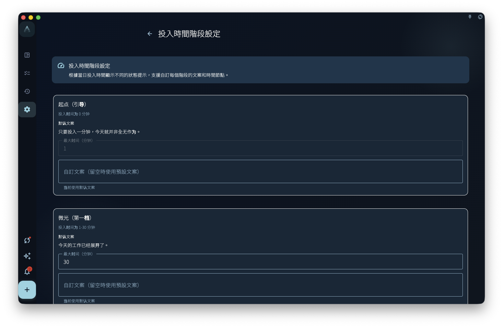
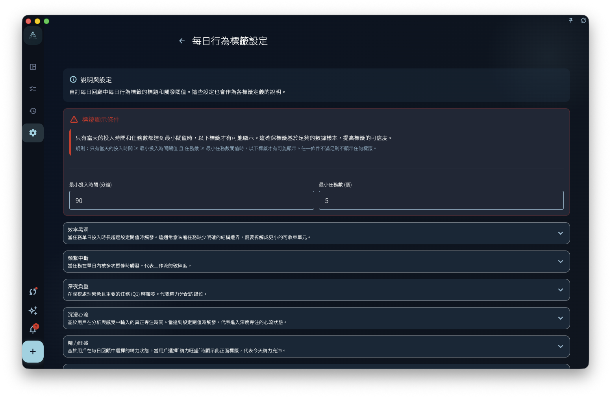
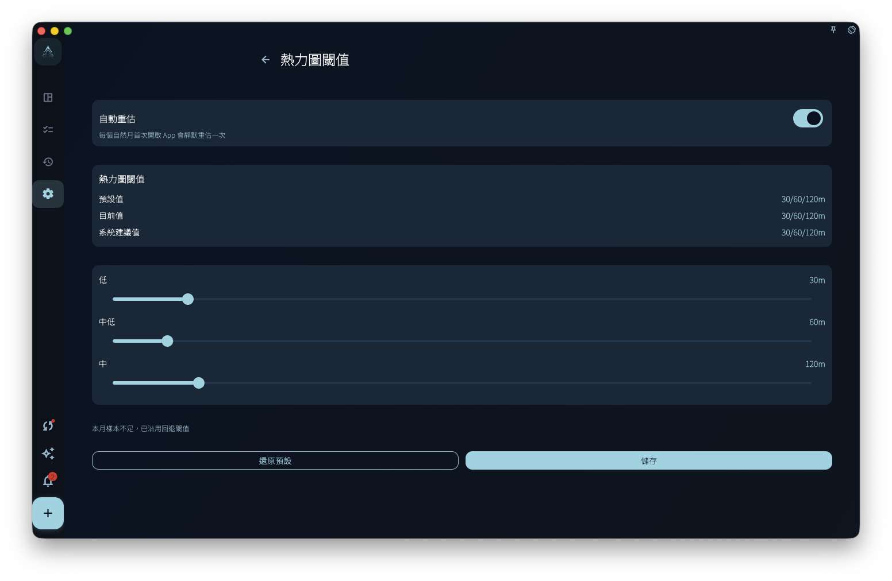

診斷和熱力圖設定幫助你理解回顧與進展的呈現方式，不是醫療、心理、績效或財務評估結論。它們根據記錄、投入時間和閾值生成提示，最終解讀仍要回到你的真實語境。

## 從哪裡進入

從會員專屬設定進入投入時間階段、每日行為標籤和熱力圖閾值。部分頁面在非會員狀態下可能只允許查看或顯示升級提示。

## 投入時間階段

投入時間階段根據當天投入時長顯示不同狀態文案。你可以調整階段的時間節點和提示語，讓回顧頁面的狀態表達更貼近自己的節奏。

<!-- manual-screenshot:id=review-diagnostic-state-settings -->

階段文案只影響展示和解釋，不會改變任務本身，也不會判斷你是否「夠努力」。

## 每日行為標籤

每日行為標籤會根據任務數量、投入時間、象限分布、暫停次數、精力選擇或深度專注時長等條件顯示提示。你可以調整部分標籤名稱和觸發閾值。

<!-- manual-screenshot:id=review-diagnostic-anomaly-settings -->

這些標籤用於輔助發現模式，不是診斷結論。閾值太低可能讓標籤過於頻繁，閾值太高也可能讓有用提示消失。

## 熱力圖閾值

熱力圖閾值決定不同投入時長在日曆或統計熱力圖上如何分層顯示。調整閾值後，顏色分布可能改變，但歷史任務資料本身不會因此改變。

<!-- manual-screenshot:id=review-heatmap-threshold-settings -->

如果頁面提供自動重估，它只是根據已有月份資料建議更合適的分層。接受建議前，仍要確認這些顏色是否符合你想觀察的節奏。

## 使用邊界

- 診斷、標籤和熱力圖只解釋 GranoFlow 中已有記錄的呈現。
- 記錄不完整時，提示也可能不完整。
- 它們不能取代專業醫療、心理、績效或財務判斷。
