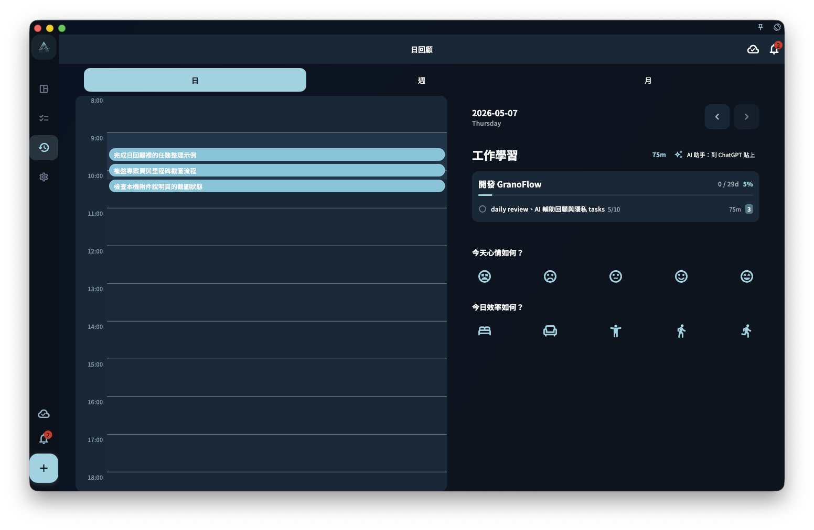

記錄用來保存你在某一天回顧時寫下的想法。你可以寫今天的感受、任務為什麼完成或沒完成、明天想先做什麼；之後切換到那一天，就能和當天的任務一起查看。

<!-- manual-screenshot:id=review-journal-records-section -->

## 記錄適合寫什麼

記錄沒有固定格式。你可以寫得很短，也可以寫多一點。常見內容包括：

- 今天的感受，例如順暢、拖延、意外、疲憊。
- 某件事為什麼完成了，或者為什麼沒完成。
- 明天想優先處理什麼。
- 某個專案的新想法。
- 任何你之後回顧時想重新看到的線索。

它不是日報，也不是流水帳。寫得短、真實，通常比寫得完整但勉強更有用。

## 記錄和任務的關係

記錄會和當天的日期綁定，不是直接和某一個任務綁定。

如果你在完成某個任務的當天寫了記錄，之後查看那天的回顧時，可以同時看到當天的任務和你寫下的內容。

刪除或修改任務**不會**自動刪除對應日期的記錄。記錄和任務是獨立保存的。

## 查看歷史記錄

在回顧頁切換日期，就可以查看那一天的歷史記錄。

只要某天有記錄，你就可以透過那天的回顧找到它。
