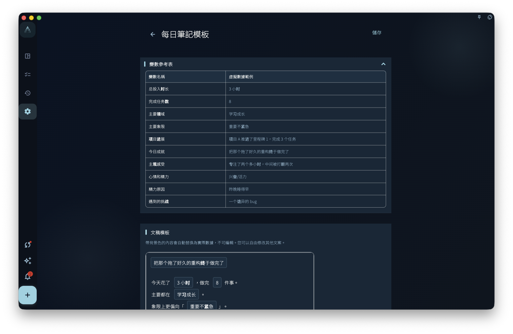
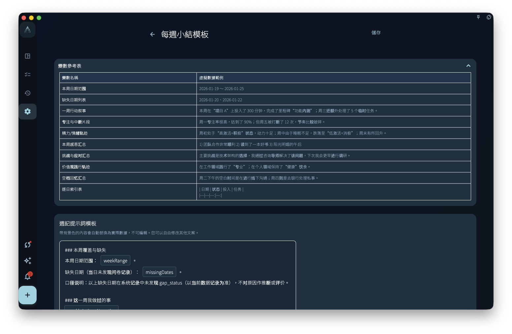

模板幫助記錄保持一致結構，不會自動補齊事實或替你寫完整篇日記。當你已有固定記錄習慣，希望每天或每週草稿先按同一格式展開時，可以使用它。

## 從哪裡進入

從會員專屬設定或回顧相關設定進入每日筆記模板、每週小結模板。

每日筆記模板影響每天生成的筆記草稿。每週小結模板影響每週自動生成或整理的週記草稿。兩者是不同模板，可以分別儲存和恢復預設。

## 如何編輯

模板裡會出現變數範例。帶變數含義的內容會在生成草稿時替換成實際資料，例如日期、任務、回顧記錄或統計摘要。

<!-- manual-screenshot:id=review-daily-note-template-settings -->

<!-- manual-screenshot:id=review-weekly-note-template-settings -->

你可以改寫普通文案、標題順序和提示語。不要把變數當成已經寫好的事實；如果某天沒有對應資料，生成結果可能為空、較短，或需要你手動補充。

## 結果和邊界

儲存模板後，後續生成的日記或週記會使用新的結構。已經生成的舊記錄不會自動改寫。

- 模板不會自動判斷哪些事實重要，也不會替你補齊沒有記錄的內容。
- 如果你刪掉關鍵變數，草稿可能缺少任務、日期或回顧脈絡。
- 恢復預設只恢復模板文字，不會刪除已有筆記。

## 和 Prompt 的區別

模板決定草稿結構，Prompt 更偏向「讓 AI 或生成器如何表達」。如果你想改變頁面上最終草稿的欄位順序，優先改模板；如果你想改變外部 AI 的改寫要求，去看「價值觀與提示詞」。
