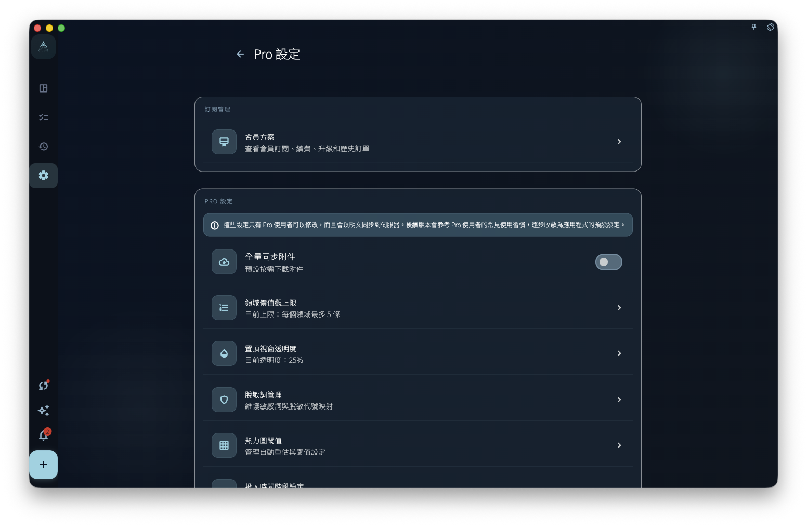
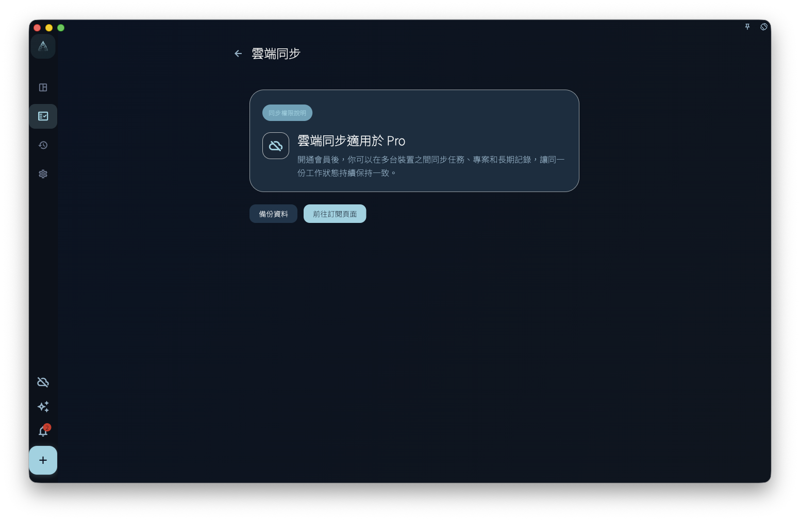

查看訂閱權益如何生效，並理解本地顯示、服務器狀態和購買憑證之間的關係。

## 從哪裡開始

從訂閱或帳號頁面查看當前權益。訂閱狀態以服務器返回的帳號訂閱狀態為準，本地顯示只用於當前界面反饋。

## 怎麼操作

- 購買後保持登入同一帳號，等待訂閱狀態刷新。
- 需要復原購買時，使用對應平臺提供的復原入口，並確認當前登入帳號是否正確。
- 如果權益沒有出現，先檢查平臺、帳號、網絡和購買記錄，再進入排查。

## 結果和邊界

訂閱會影響可用權益，但不會改變你的任務資料所有權。購買憑證、平臺訂單和 GranoFlow 帳號之間需要能對應起來。

- 不同平臺的購買不一定自動轉移到另一個平臺。
- 支付卡號等支付憑證由平臺處理，GranoFlow 不把它們作為手冊操作的一部分儲存。

## 會員專屬設定

會員專屬設定集中放置更進階的個人化能力，例如 AI 脫敏詞、Helper 助手提示詞、回顧 Prompt、記錄模板、診斷配置和熱力圖閾值。部分入口在非會員狀態下可能只讀、顯示升級提示，或不能儲存修改。

<!-- manual-screenshot:id=subscription-vip-settings -->

這些設定說明你能使用哪些權益，不直接解決具體同步衝突、資料恢復或賬號恢復問題。涉及資料安全、雲端金鑰或新裝置入雲時，請回到資料安全章節按對應流程處理。

## 同步會員說明

當你使用同步入口但目前賬號沒有可用權益時，GranoFlow 可能顯示同步會員說明頁。這個頁面解釋為什麼同步能力需要會員，以及可以從哪裡查看或開通權益。

<!-- manual-screenshot:id=subscription-sync-vip-upsell -->

看到同步會員說明，不代表本地資料已經遺失，也不代表雲端恢復已經執行。它只是同步入口的權益門檻提示；真實同步狀態仍以同步頁、賬號狀態和資料安全相關頁面為準。

## 下一步

復原購買仍失敗時，保留平臺訂單資訊並查看訂閱相關排查。
