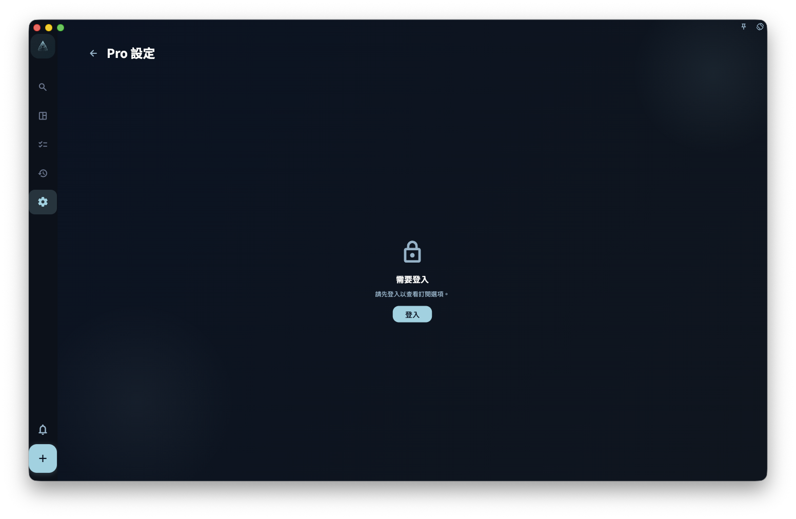
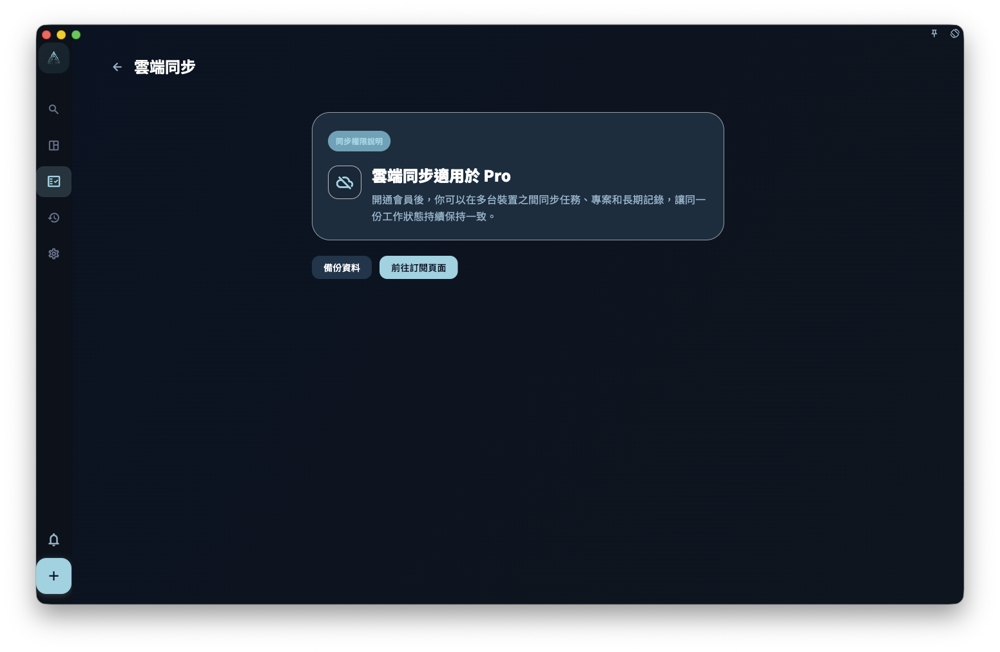

如果你想知道自己能不能使用某個會員功能，請先到該功能本身的入口查看：GranoFlow 沒有單獨的「會員專區」。會員權益會出現在同步、AI 輔助、個人化設定等相關功能的位置。

會員狀態以伺服器回傳的主會員能力為準。Pro 需要仍在有效期內；天使會員是長期主會員權益，普通到期不會讓它失效。只有退款、轉移等會撤銷權益的情況，才會讓天使會員不再可用。

<!-- manual-screenshot:id=subscription-vip-settings -->

## 會員專屬功能

以下功能需要會員權益才能完整使用。

### 同步

- 多裝置雲端同步
- 同步歷史與狀態查看

### AI 輔助

- AI 標題解析（識別日期、標籤、提醒）
- 剪貼簿助手
- AI 脫敏詞自訂

### 個人化

- AI 助手與提示詞設定
- 回顧 Prompt 自訂
- 日記、週記、價值觀和工作 / 學習日報 Prompt 自訂
- Helper 提示詞
- 診斷設定與熱力圖閾值設定

Prompt、AI 改寫相關入口會先集中在會員設定裡的「提示詞設定」，進入後再選擇具體場景。

## 非會員狀態下會怎樣

非會員通常也能看到大多數會員專屬入口。看到入口，不代表你已經有權限使用。

你可能會遇到兩種情況：

- 點選入口後，App 顯示升級提示。
- 某些設定可以查看，但會變成唯讀，無法儲存修改。

這樣做是為了讓你知道功能在哪裡，以及訂閱後可能會解鎖哪些設定。

## 同步權益的特別說明

同步是會員專屬功能。如果目前帳號沒有可用權益，同步入口會提示你查看或開通會員。

<!-- manual-screenshot:id=subscription-sync-vip-upsell -->

看到同步權益說明頁，**不代表同步已經開始，也不代表你的本機資料已經遺失**。本機資料獨立於同步權益存在。

:::note[權益以伺服器為準]
App 本機顯示的權益狀態，來源於伺服器回傳的帳號資訊。網路不佳時可能會暫時顯示不正確，稍後重新整理即可。
:::
