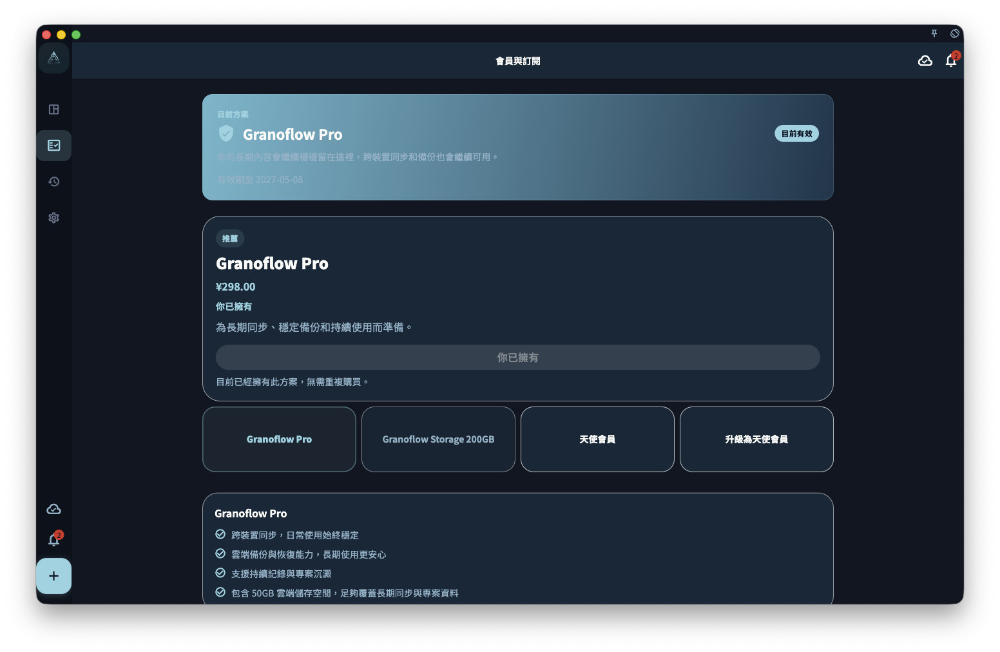

你不需要先訂閱，也可以使用 GranoFlow 的核心功能：任務、專案、價值觀、輕日記、回顧、本機資料和備份都能免費使用。會員主要適合兩種需求：你想在多台設備之間同步，或想使用更多個人化定制。

所以，剛開始用 GranoFlow 時，可以先用免費版把生活和工作整理起來。等你確認它適合自己的節奏之後，再決定要不要開通會員。

## 免費 vs 會員，有什麼差別

| 功能 | 免費 | 會員 |
|------|------|------|
| 任務、專案、價值觀 | ✅ | ✅ |
| 輕日記、回顧、備份 | ✅ | ✅ |
| AI 任務解析與思路梳理 | ✅ | ✅ |
| 多設備雲端同步 | ❌ | ✅ |
| 個人化定制 | ❌ | ✅ |

簡單說：**免費版適合先認真試用，也適合長期只在一台設備上使用；會員適合需要多設備銜接，或希望介面、主題和使用細節更符合自己習慣的人。**

## 訂閱狀態在哪裡查看

打開 GranoFlow 設定，進入帳號／訂閱頁面，就可以查看目前訂閱狀態。這個頁面通常也會顯示 Pro 權益摘要，以及購買或恢復購買入口。

**重要**：訂閱狀態來自伺服器，不是 App 自己決定的。如果你已經購買，但權益還沒有出現，先等一下讓狀態重新整理；如果仍然沒有變化，再檢查網路和目前登入的帳號。

## 最常見的問題

**買了為什麼沒有權益？**
先確認一件事：你現在登入的帳號，和購買時用的帳號，是不是同一個。

**換手機後權益去哪了？**
用同一個帳號登入，權益通常會跟著帳號一起回來。

**不同平台（iOS／Android／macOS）的購買可以共用嗎？**
不一定。請看[平台購買與恢復購買](/zh-tw/subscription/platforms-and-restore/)。

## 訂閱和資料，哪個更重要

訂閱決定你能使用哪些功能，但不決定你的資料歸誰。

即使訂閱到期，你的本機任務、專案、價值觀、輕日記和備份資料仍然保留，你也可以繼續使用所有免費功能。會員只是讓這些內容更容易跨設備同步，並讓介面和體驗更貼合你。
