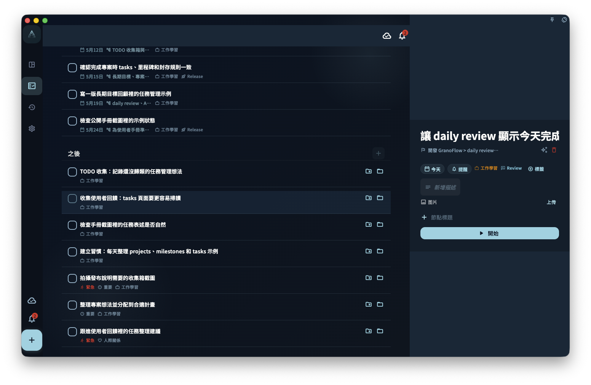

如果一個任務太大、不知道從哪裡開始，就打開任務詳情，在「步驟」或「節點」區域把它拆成幾個小動作；每次只完成一個節點，所有節點都做完後，父任務就可以完成。

## 怎麼拆解任務

打開任務詳情，找到「步驟」或「節點」區域，點擊新增第一個子步驟。

每個步驟（節點）只寫一個可以直接去做的動作。例如「寫完整個報告」太大，可以拆成：

- 「整理參考資料」
- 「寫大綱」
- 「寫正文第一段」
- 「修改」
- 「傳給同事確認」

不用一次把所有步驟想完。先寫最近能做的一兩步，做完後再補新的步驟也可以。

## 調整節點順序和層級

在桌面端，可以用節點左側的拖曳手柄調整順序或層級；鍵盤焦點在節點列表上時，可以用 `Alt+↑ / Alt+↓` 上下移動，用 `Alt+← / Alt+→` 提級或縮排。

要刪除節點，點擊節點行右側的刪除按鈕；鍵盤也可以用 `Delete` 或 `Backspace` 刪除目前節點。如果這個節點下面還有子節點，刪除按鈕不會顯示，需要先刪除或移動子節點。刪除後，系統會暫時隱藏這個節點，並在底部提示裡提供「復原」。

## 節點和父任務的關係

- 完成節點後，父任務的進度會更新，例如「3/5 完成」
- 所有節點都完成後，父任務可以標記為完成
- 如果你又**新增了一個未完成節點**，父任務會回到待辦；這是正常的，系統是在提醒你還有事情沒做

:::tip[不要嵌套太深]
節點可以繼續新增子節點，但不要嵌套太多層。兩層通常就夠了。更複雜的結構，通常更適合拆成獨立任務或專案里程碑。
:::

## 拆解任務 vs 建立專案里程碑

| 適合用節點拆解 | 適合用里程碑劃階段 |
| --- | --- |
| 任務在幾小時到幾天內能完成 | 目標需要幾週甚至幾個月 |
| 步驟互相依賴、順序固定 | 階段之間相對獨立 |
| 不需要跨任務管理進度 | 需要在專案層面追蹤進展 |

簡單說：節點回答「下一步怎麼做」，里程碑回答「專案做到哪個階段了」。
