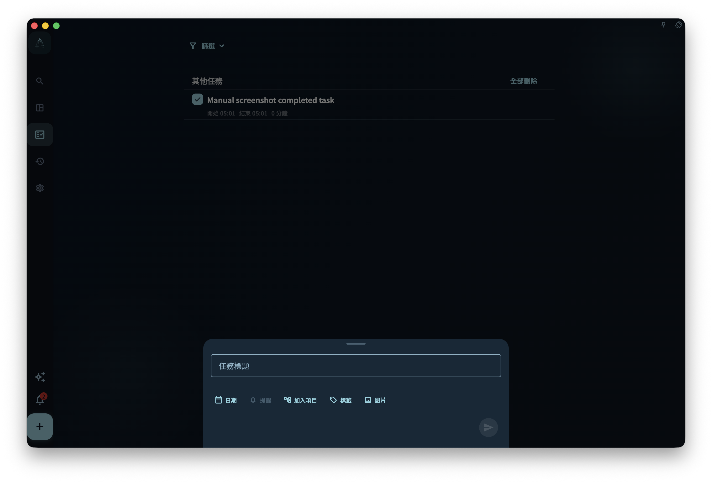
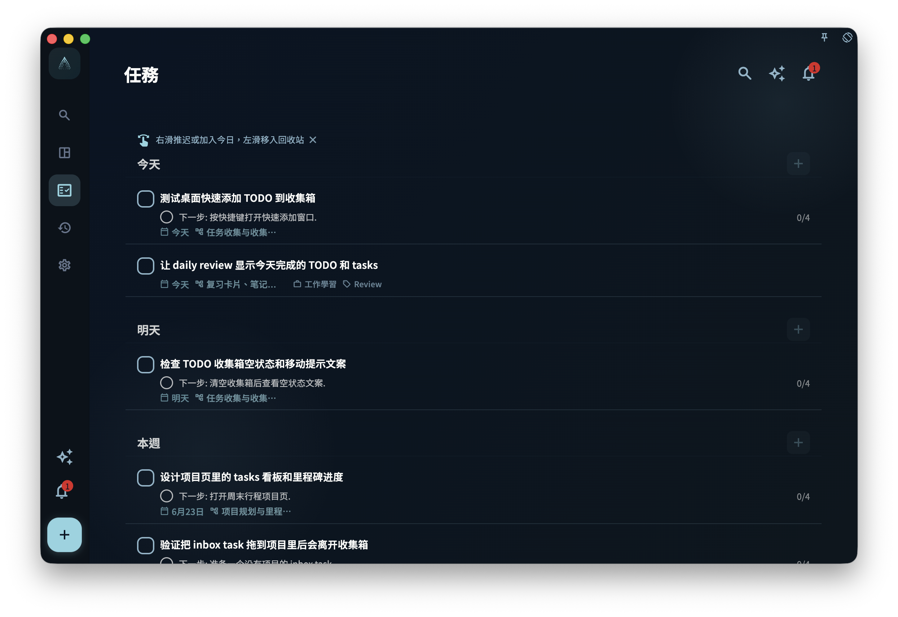
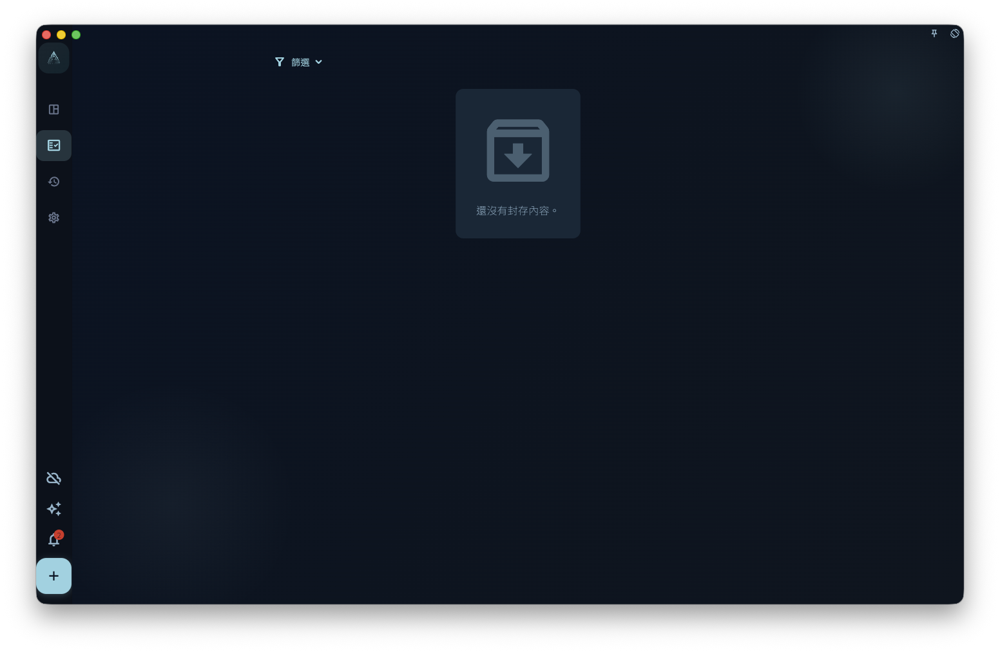
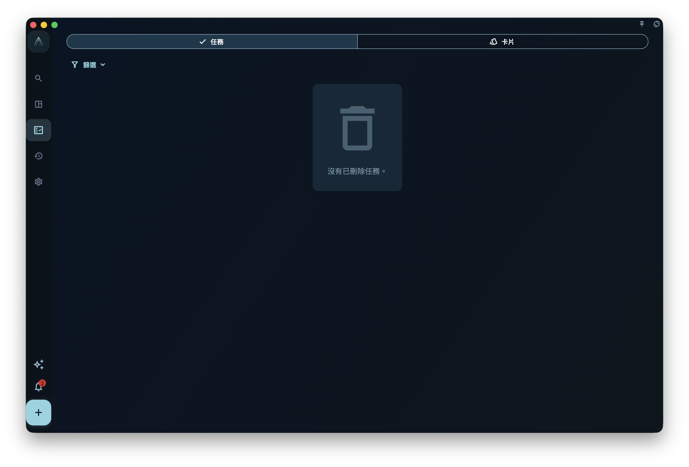
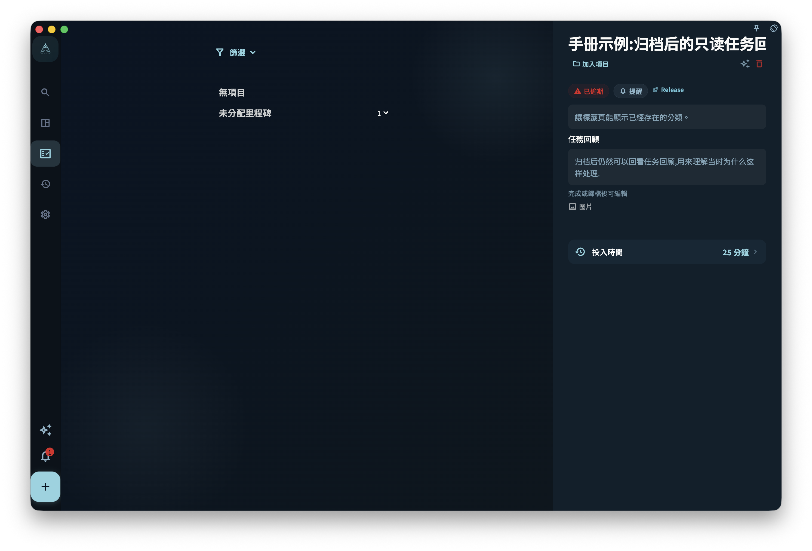

任務從列表裡不見了，先別急著以為它丟了。最常見的原因是：它被篩選條件藏起來了，被安排到了某一天，放進了專案，已經完成，被歸檔，或者在資源回收筒裡。

GranoFlow 裡和「任務不見了」最相關的三個狀態是：

- **已完成**：事情做完了，會進入完成檢視和日回顧統計
- **已歸檔**：暫時不用看，但保留記錄
- **資源回收筒**：任務被刪除了，但資源回收筒還沒有清空

## 完成

一件事做完後，可以在任務詳情裡點「完成」，也可以從列表上的完成入口把它標記為完成。完成後，這個任務會：

- 從當前待辦列表裡消失
- 記錄一個完成時間
- 出現在「已完成」檢視裡
- 用於日回顧統計
- 在任務詳情裡隱藏「開始」和「完成」按鈕，避免已經結束的任務再次被當作待辦啟動

如果這條任務正在專注中，點「完成」會先結束當前專注會話，再完成任務，並把它從「當前任務」裡清掉。這樣任務狀態、專注記錄和任務列表頂部的當前任務會保持一致。

<!-- manual-screenshot:id=tasks-completed-archived-trash -->

:::tip[小技巧]
如果你還想在日回顧裡看到完成記錄，不要隨手刪除已完成任務。已完成任務不是垃圾，它們是你的完成記錄。
:::

## 完成後先校準時間

任務剛完成時，系統會記錄一個完成時間。這個時間已經足夠讓任務進入「已完成」檢視和日回顧，但它不一定等於你真實開始和結束這件事的時間。

如果你希望以後復盤更準確，完成任務後建議打開這條已完成任務的詳情，點擊「時間記錄」。彈出的時間記錄視窗可以修改開始時間和完成時間。你可以把它改成更接近真實情況的時間段，例如「下午 3:10 開始整理資料，4:05 結束」，而不是只留下點完成按鈕的那一刻。

<!-- manual-screenshot:id=tasks-completion-time-record-editor -->

這一步很推薦，但不是強制。它尤其適合這些任務：

- 你沒有點「開始」，但實際做了一段時間。
- 你忘了及時點完成，完成時間晚於真實結束時間。
- 你想在日回顧裡看到更接近真實的投入時間分佈。
- 你希望以後回看這一天時，能知道時間大概花在了哪裡。

時間記錄會影響日回顧裡的任務時間塊和「今日投入時間」。日回顧按當天任務時間塊的聯集計算投入時間；如果兩個任務時間重疊，重疊部分不會重複計算。為了避免明顯不合理的記錄，開始時間必須至少早於完成時間 1 分鐘，完成時間也不能設在未來。

完成後，任務詳情裡會顯示「任務回顧」，並允許編輯。這裡適合記錄確認過的情況、問題和經驗。

已完成任務詳情還會顯示「心流時間」。它不是從開始時間到完成時間自動算出來的「投入時間」，而是你手工記錄的真正專注時間；同一天完成的任務會共用這一天的心流時間。任務歸檔後可以繼續編輯任務回顧，但不再顯示可編輯的心流時間入口。

專注會話和心流時間不是同一個欄位。專注會話記錄你在某條任務上啟動和結束的一段投入；心流時間是你在回顧裡手工確認的主觀專注時間，用來幫助復盤這一天真正沉進去多久。兩者都可以幫助回顧，但含義不同。

## 歸檔

歸檔適合這種任務：你現在不想天天看到它，但以後可能還需要知道它存在過。

例如：專案裡的舊任務、已經過期但有參考價值的事項、不想放在當前列表裡但也不想刪除的內容。

<!-- manual-screenshot:id=tasks-archived-list -->

已歸檔檢視只處理任務歸檔。卡片歸檔和任務歸檔的含義不同：卡片退出主動複習，但仍可能留在任務和回顧上下文裡。要查看已歸檔卡片，進入「卡片管理」，點「篩選」，在狀態裡選擇「已歸檔」。如果你想理解卡片為什麼可以退出主動複習但仍留在任務上下文裡，閱讀 [練習、掌握與內化](/manual/zh-tw/review-cards/study-and-internalize/)。

歸檔和完成不是一回事：

- **完成**：表示任務真的做完了，會進入完成統計
- **歸檔**：只是把任務從當前檢視收起來，不代表做完，也不進入完成統計

## 資源回收筒

刪除任務後，任務會進入資源回收筒。只要資源回收筒還沒有被清空，你還可以去資源回收筒查看它。

外層資源回收筒只處理已刪除任務。已刪除卡片不在這裡出現；要查看卡片資源回收筒，進入「卡片管理」，點「篩選」，在狀態裡選擇「資源回收筒」。如果你是從某個卡組進入卡片管理，資源回收筒也會按當前卡組範圍顯示。

恢復任務時，如果它原來屬於已經刪除的專案或里程碑，GranoFlow 會讓你選擇：一併恢復原專案和里程碑，或只把任務恢復到收集箱。選擇只恢復任務時，它會變成沒有專案、沒有里程碑、沒有日期的一般收集箱任務，你之後可以再重新整理。

<!-- manual-screenshot:id=tasks-trash-list -->

:::caution[清空前想好]
手動清空資源回收筒是不可逆的。如果任務曾經屬於某個專案，或者還有回顧價值，清空後就不能再靠資源回收筒找回了。
:::

## 找不到任務怎麼辦

按這個順序查，通常最快：

1. 看看是不是篩選條件把它隱藏了，比如只顯示「今天」的任務。
2. 想想它是不是設定了日期。如果有日期，去那一天的任务列表找。
3. 想想它是不是加進了某個專案。如果有專案，去專案頁面找。
4. 如果它已經做完了，去「已完成」檢視找。
5. 如果你不想在當前列表裡看到它，可能已經把它歸檔了，去「已歸檔」檢視找。
6. 如果你刪除過它，去資源回收筒找。

大多數找不到的任務，都在上面這些地方。

## 重新啟用後的任務回顧

如果你完成任務後寫了任務回顧，之後又取消完成或重新啟用任務，已有回顧不會被清空。未完成時，任務詳情不會顯示任務回顧；任務再次完成或歸檔後，回顧會重新顯示並可以編輯。

<!-- manual-screenshot:id=tasks-detail-review-readonly -->

