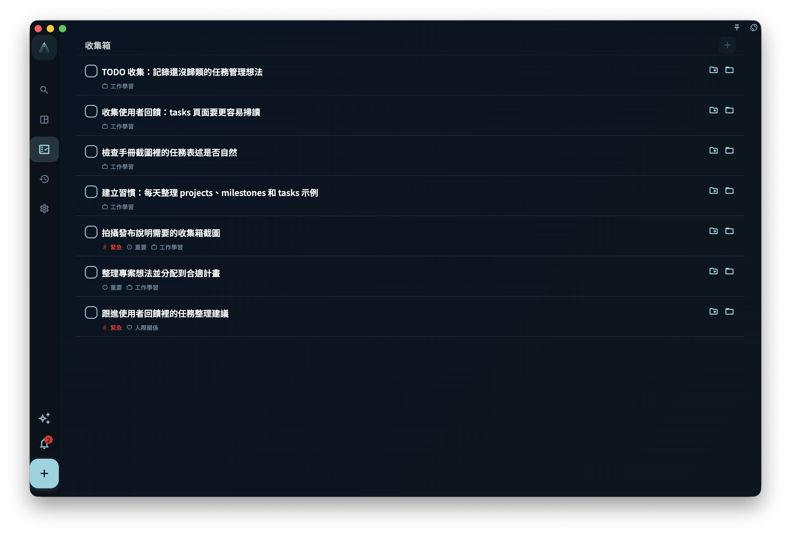

想快速建立任務，只需要輸入一個標題，然後儲存。其他內容都可以先不填；等你要安排日期、歸到專案、加標籤或拆成步驟時，再打開任務補充。

## 從哪裡建立任務

| 入口 | 適合的場景 |
| --- | --- |
| 底部 **+** 按鈕 | 想立刻記下一件事 |
| 收集箱頁面內的輸入框 | 正在整理收集箱時順手新增 |
| 專案或里程碑頁面內 | 建立後希望它直接屬於這個專案或階段 |
| 已有任務詳情裡的節點 | 想把一個大任務拆成更小的步驟 |

## 任務編輯介面

{/* manual-screenshot:id=tasks-create-edit-dialog */}

建立或編輯任務時，你會看到這些欄位。只有標題必須填寫。

| 欄位 | 是否必填 | 作用 |
| --- | --- | --- |
| 標題 | ✅ 必填 | 任務名稱。寫得越具體，之後越容易執行 |
| 描述 | 選填 | 放背景資訊、連結、備註等補充內容 |
| 截止日期 | 選填 | 設定後，任務會出現在對應日期的任務清單裡 |
| 提醒 | 選填 | 到指定時間發通知；提醒時間不能設在過去 |
| 專案 | 選填 | 設定後，任務會從收集箱移到對應專案裡 |
| 里程碑 | 選填 | 讓任務屬於專案中的某個階段 |
| 標籤 | 選填 | 用來篩選任務；一個任務可以有多個標籤 |
| 節點 | 選填 | 把任務拆成更小的步驟 |
| 任務回顧 | 選填 | 記錄完成後的複盤內容；完成或封存後可以編輯 |

:::tip[善用自然語言輸入]
在標題輸入框裡，你可以直接寫 `#標籤名`、`@日期`、`~提醒時間`，GranoFlow 會自動解析。比如輸入 `整理報告 @明天 #工作`，會自動識別出明天的日期和「工作」標籤。詳細規則見[用自然語言寫任務](title-parser)。
:::

## 儲存後任務去哪了

任務儲存後出現在哪裡，取決於你填了哪些欄位：

- **沒有日期、沒有專案** → 進入收集箱
- **有日期** → 出現在那一天的任務清單裡
- **有專案** → 出現在對應專案裡
- **在專案頁面裡建立** → 直接歸屬到那個專案

修改日期、專案或里程碑，不會建立另一個任務，只是改變同一個任務的位置或歸屬。

## 編輯已有任務

點擊任何任務，就可以打開任務詳情。改完欄位後，離開詳情頁時會自動儲存。

任務完成或封存後，詳情裡會顯示「任務回顧」。你可以在這裡補充這件事實際花了多久、後來確認了什麼、下次要注意什麼。如果你先完成任務並寫了回顧，之後又把任務恢復為未完成，已有回顧不會被清空；任務再次完成或封存後，回顧會重新顯示並可以編輯。
:::caution[注意]
提醒不能設定在已經過去的時間。如果你選擇的提醒時間已經過了，系統會提示你重新選擇。
:::

完成、封存和刪除是三種不同操作。填寫或修改欄位，不會讓任務自動變成完成狀態。
