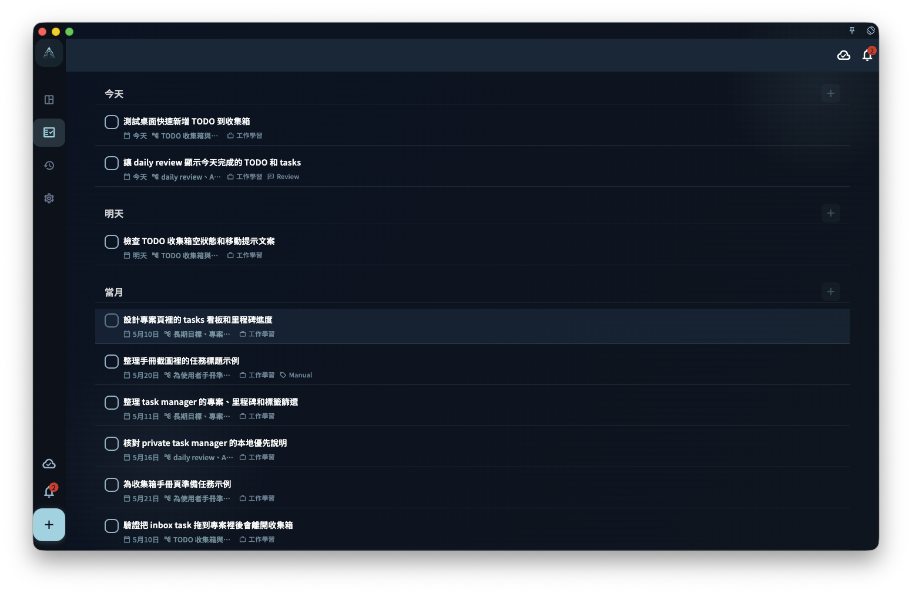

GranoFlow 的任務系統幫助你把零散想法變成清晰的下一步行動。

任務是 GranoFlow 中最小的行動單位。你可以先記錄一件事，等它與專案、里程碑或長期領域的關係變得清楚後，再決定如何整理。

## 任務入口

你可以從底部列中間的 `+` 按鈕新增任務。

<!-- manual-screenshot:id=tasks-overview-main -->

快速新增入口優先服務於「先收集」。先寫下眼前最明確的一件事，再視需要設定日期、專案、里程碑和標籤。儲存任務前，不需要先想清楚完整結構。

如果任務沒有日期，也沒有專案，它會先留在收集箱。給它分配專案後，它會從收集箱離開，出現在對應專案裡。這樣收集箱始終更像一個待整理入口，而不是固定資料夾。

你也可以透過左上角選單找到任務相關入口：

- 收集箱：暫時存放剛記錄的想法和任務，等你之後再整理。
- 任務列表：查看正在推進的任務。
- 已完成：查看已經完成的任務。
- 已歸檔：保存不再需要日常關注的任務或相關內容。
- 回收站：查看已刪除、等待後續處理的內容。

## 任務、專案、里程碑與領域

任務用於具體行動。

複雜任務可以繼續拆成更小的步驟。這樣你不必把「大任務」一次做完，可以先把下一步寫清楚。

專案把圍繞同一目標或方向的任務組織在一起。

里程碑標記專案中的階段目標或有意義的進展點。

領域描述你長期在意的生活範圍和價值，例如工作、學習、關係、健康或創作生活。

你不需要一次搭好完整結構。先從任務開始，只有當上層結構真的有用時，再把任務向上連線。

## 任務狀態與日常使用

任務還在推進時，可以留在你的任務列表中。

如果你把某個任務標記為進行中，系統會盡量保持目前只有一個進行中的任務，避免多個任務同時佔用注意力。

完成後，把它標記為已完成。

如果它不再需要日常關注，但仍然值得保留，可以歸檔。歸檔後的任務更接近歷史記錄，不適合繼續當作日常任務反覆編輯。

如果某件事新增得太早，或只是誤加，可以刪除，並之後在回收站中復原或繼續清理。

## 不同螢幕上的版面

在寬螢幕或桌面模式下，任務相關頁面可能會顯示側邊導覽或更寬的版面。

在窄螢幕或手機上，你主要透過底部導覽、左上角選單和底部 `+` 按鈕操作。

不同平台的視覺細節可能略有差異，但收集、任務列表、完成、歸檔和回顧之間的關係保持一致。

## 第一次使用

如果這是你第一次使用任務系統，點按底部列中間的 `+`，先寫下一件清楚的事。

儲存後，再判斷它只是一個普通任務，還是應該屬於某個專案、里程碑或長期領域。

不要一開始就整理所有東西。先記錄一個真實的下一步行動。
