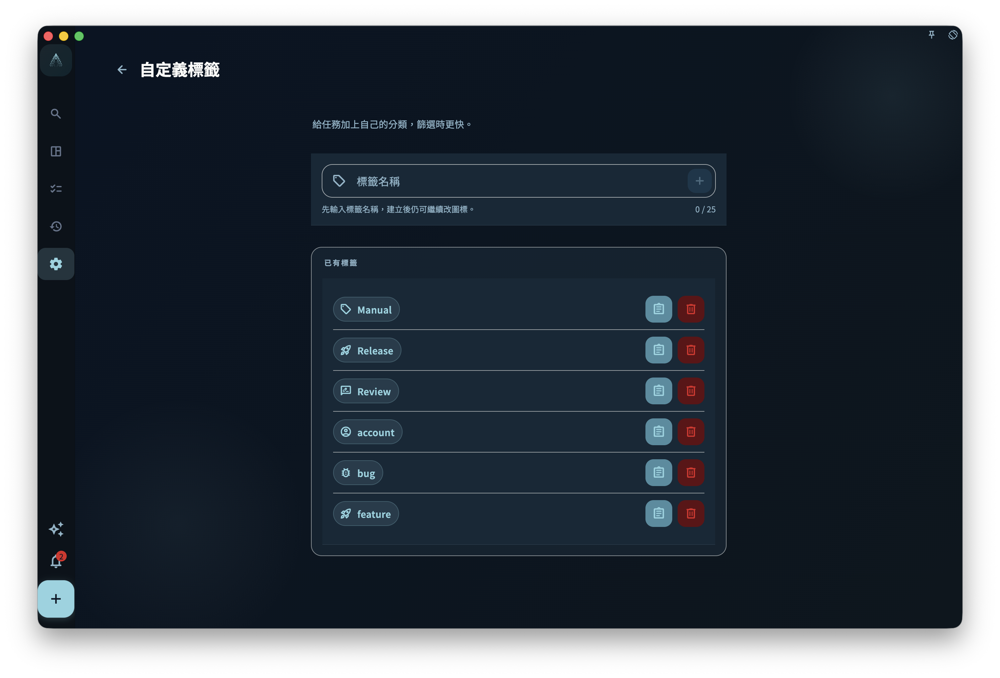

想用「狀態、類型、精力、臨時重點」這類角度標記任務，就用標籤。專案說明任務屬於哪個目標；標籤說明這個任務有什麼共同特徵，方便你之後篩選和整理。

例如你有「健身 App 開發」這個專案，裡面的任務有些是「需要設計稿」，有些是「等待第三方 API」。這些不是新的專案，而是跨專案都可能出現的狀態或類型，就適合用標籤。

## 怎麼給任務加標籤

在新建任務或打開任務詳情時，找到標籤區域，然後選擇已有標籤，或輸入新名稱建立標籤。

<!-- manual-screenshot:id=tasks-tags-management -->

即使截圖沒有載入，也可以這樣理解：

- 已有標籤會顯示為可選項
- 找不到合適的標籤時，可以輸入一個新名稱來建立
- 一個任務可以同時加上多個標籤

## 自訂標籤範本

在標籤管理裡編輯已有自訂標籤時，可以補充描述範本和節點範本。之後任務選擇這個標籤時，如果任務還沒有描述和節點，GranoFlow 會把範本內容複製到這條任務自己的描述和節點裡。任務已經有描述或節點時，範本會跳過，不會覆蓋已有內容。

範本是一次性複製：複製後，內容就屬於任務本身。以後修改或刪除標籤範本，不會自動改寫已經建立過的任務。

內建範例 `account`、`bug` 和 `feature` 都是普通自訂標籤。`account` 適合帳號整理類任務，預設描述範本包含平台名稱、網址、電子郵件、手機、第三方聯合登入和備註，不包含密碼欄位；`bug` 適合記錄重現步驟、預期結果和實際結果；`feature` 適合記錄使用者價值、使用場景和驗收標準。

## 標籤用來記什麼好

標籤適合表達**跨專案、會重複使用**的分類。下面這些都比較適合：

| 用途 | 標籤範例 |
| --- | --- |
| 情境 / 精力 | `低精力` `深度工作` `零碎時間` |
| 等待狀態 | `等待他人` `等待回覆` `待確認` |
| 類型 | `電話` `創意` `管理` |
| 臨時標記 | `本週重點` `稍後處理` |

不建議把專案名稱複製成標籤。任務已經在專案裡時，不需要再用同一個專案名稱標一次。

## 刪除標籤的影響

刪除一個標籤**不會**刪除使用它的任務。它只會把這個標籤從那些任務上移除。

:::caution[刪前確認]
刪除標籤是不可復原的。確認不再需要這個分類，再操作。
:::

## 標籤太多怎麼辦

標籤太多會讓篩選變得沒用。建議定期整理：

- 合併意思接近的標籤
- 刪除已經沒有人使用的標籤
- 保持標籤名稱簡短、容易區分
