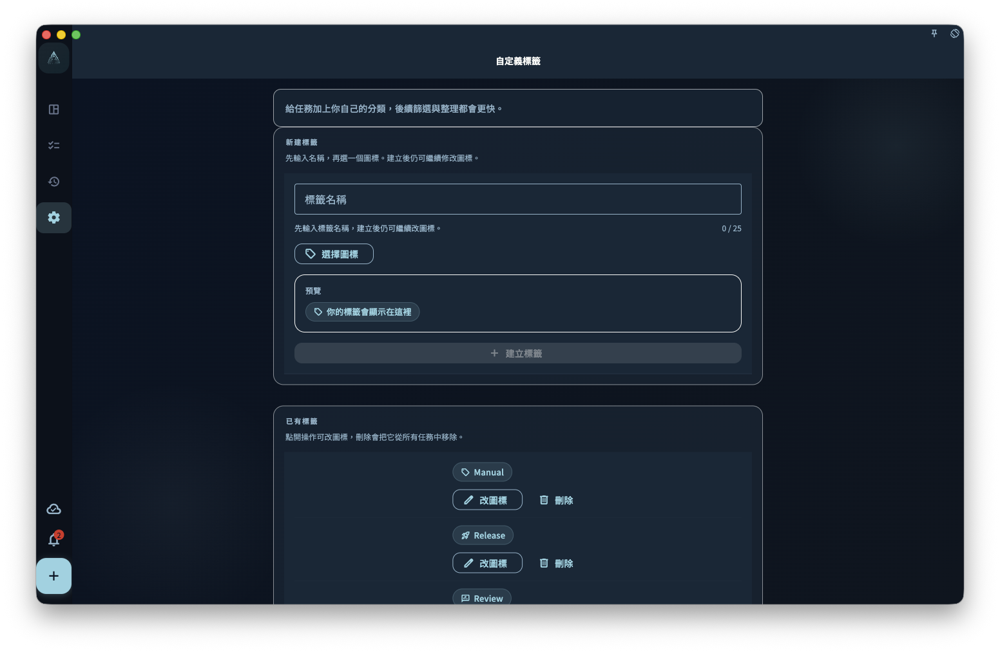

用標籤給任務補充專案之外的分類，並瞭解建立、選擇、刪除標籤時對已有任務的影響。

## 從哪裡開始

在任務詳情或新建任務時打開標籤選擇器。已有標籤會作為候選出現；需要新分類時再建立自定義標籤。

<!-- manual-screenshot:id=tasks-tags-management -->

## 怎麼操作

- 選擇一個或多個標籤後儲存，任務會在相關標籤篩選中出現。
- 建立標籤時使用清晰、長期會複用的名稱；標籤不是臨時備註，適合表達場景、精力、領域或處理方式。
- 刪除標籤前確認影響範圍。刪除標籤會從使用它的任務上解綁，而不是刪除這些任務。

## 結果和邊界

標籤是橫向分類，適合補充專案之外的視角。同一個任務可以屬於專案，也可以帶多個標籤。

- 標籤名稱需要保持可區分；重複或含義過近會讓篩選變得混亂。
- 刪除標籤不會復原到某個歷史標籤狀態。

## 下一步

需要把任務放進長期目標時，繼續閱讀“專案概覽”。
