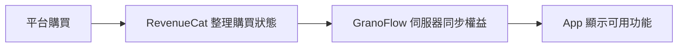

如果你的會員沒有顯示，先確認三件事：你登入的是哪個 GranoFlow 帳號、購買是透過 Apple 還是 Google、訂閱現在是否仍然有效。帳號、訂閱、會員和權益不是同一件事，任何一環沒有對上，App 裡看到的結果都可能不正確。

## 四個詞的區別

| 詞 | 是什麼 |
| --- | --- |
| **帳號** | 你在 GranoFlow 的身份，用來辨識資料和權益屬於誰 |
| **訂閱** | 你在 Apple 或 Google 平台上的購買關係 |
| **會員** | GranoFlow 對外描述的使用者身份，例如 Pro |
| **權益** | 目前帳號實際可以使用哪些功能 |

可以把流程理解成這樣：

所以，「我點過購買按鈕」不等於「目前帳號一定已經有權益」。平台購買、購買狀態整理、伺服器同步、App 更新顯示，每一步都需要對上。

## 登入有什麼用

不登入也可以使用 GranoFlow 的本機功能，例如記錄任務、整理專案、寫回顧。

登入帳號後，GranoFlow 才能確認這些內容和權益屬於誰。以下功能通常需要登入並經過伺服器確認：雲端同步、多裝置使用、會員權益識別、還原購買、刪除帳號。

> 本機使用解決「我現在要怎麼記錄」。登入帳號解決「這些資料和權益屬於誰」。

如果你開啟了離線模式，或者登入、購買服務暫時無法使用，本機功能不會因此停止。只是登入、同步、權益確認和還原購買需要稍後再試。

## 還原購買

換裝置或重裝 App 後，如果會員權益沒有出現，可以嘗試「還原購買」。它的作用是讓 Apple 或 Google 重新檢查購買記錄，再和目前登入的 GranoFlow 帳號權益對齊。

還原購買不能解決所有情況：

- 如果購買綁定的是另一個 GranoFlow 帳號，目前帳號不會自動得到權益
- 如果訂閱已經退款或過期，還原購買也不會重新開通權益
- 如果購買服務暫時無法使用，App 會提示稍後再試，本機資料不會受到影響

## 桌面端為什麼沒有購買按鈕

桌面端，也就是 Windows、macOS 和 Linux 版本，為了符合各平台分發規則，可能不會顯示購買入口。

這不代表桌面端少了會員功能。你已經有會員的話，在桌面端登入同一個 GranoFlow 帳號後，對應功能會正常解鎖。需要購買會員時，請從 iOS 或 Android 端操作。

## 遇到問題時先問自己

1. 我現在登入的是哪個 GranoFlow 帳號？
2. 購買發生在哪個平台，Apple 還是 Google？
3. 目前訂閱是否仍然有效？
4. App 是否已經更新了權益？
5. 有沒有把不同帳號搞混？

這幾個問題可以定位絕大多數會員和權益問題。
