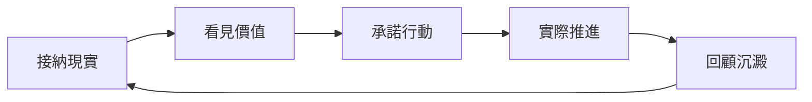
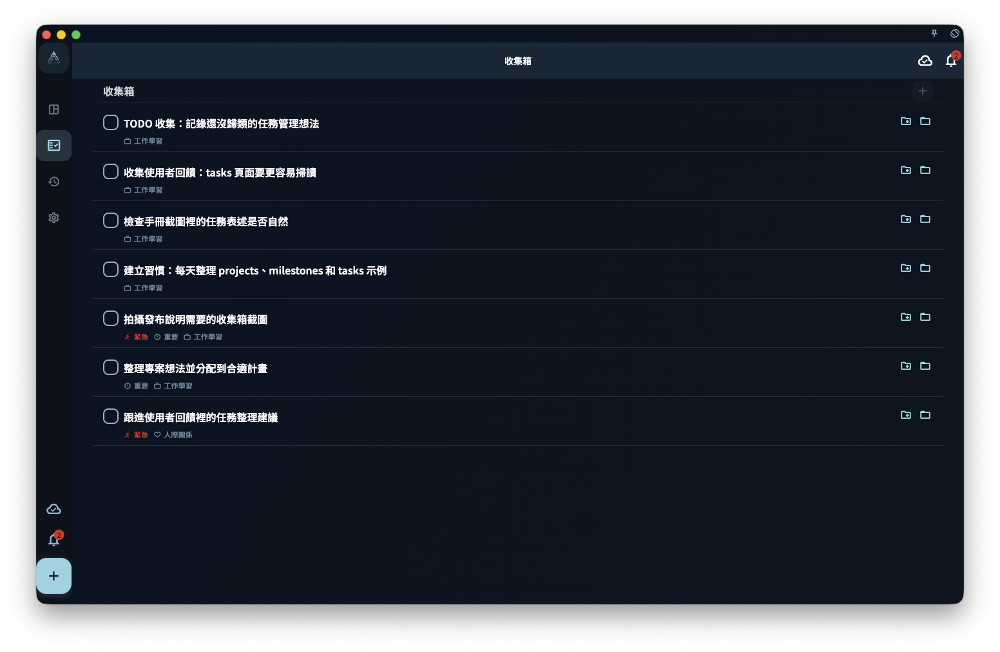

GranoFlow 借用了 **ACT（接納與承諾療法）** 的思路，來自 Russ Harris 的《幸福的陷阱》：不必先消滅焦慮和混亂，才能過自己重視的生活。

- **接納**：把佔用注意力的事先寫下來，不用先想清楚
- **價值**：我想成為什麼樣的人？
- **承諾行動**：把方向落成專案和任務
- **回顧**：讓完成的事留下痕跡

:::tip[中斷不是失敗]
停下之後還能回來，這才是重點。
:::

