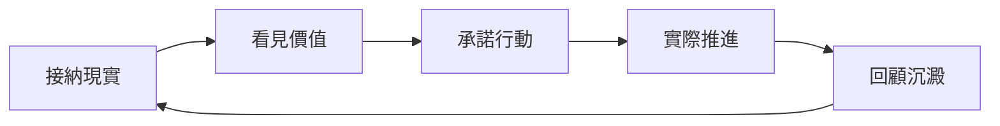

這頁要回答的是：當你焦慮、混亂、還沒準備好時，怎麼用 GranoFlow 繼續推進重要的事？答案是：先接納現在的狀態，把事情寫下來，再把你重視的方向變成今天能做的一小步。

很多任務工具會讓人以為：先把狀態調整好，再開始行動。

例如，等不焦慮了再工作。等想清楚了再做計畫。等生活穩定了再開始改變。

但現實通常不是這樣。完全準備好的那一天，可能一直不會來。

GranoFlow 借用了 **ACT（接納與承諾療法）** 的思路，來自 Russ Harris 的《幸福的陷阱》：你不必先消滅焦慮和混亂，才能過自己重視的生活。你可以帶著現實中的不完美，仍然做下一步。

## 一個循環：接納 → 價值 → 行動 → 回顧

這個循環的意思是：先承認現在的現實，再看見自己在意什麼，然後選一個具體動作去做，最後透過回顧把經驗留下來。

你不需要每天完整走完一遍。有時你只是寫下一件事。有時你只是做一次回顧。這些都算數。

## 接納：先寫下來，不用先想清楚

在 GranoFlow 裡，第一步不是把自己調整到完美狀態，而是先把占用注意力的事寫下來。

把它寫進收件匣。這個時候，你暫時不需要解釋它為什麼在這裡，也不需要馬上分類、排序或想出完整計畫。

如果截圖沒有載入，也不影響理解：你要做的只是找到收件匣，把腦中正在占用注意力的事情先記進去。

接納不是躺平。接納的意思是：我先承認現在就是這樣，然後從這裡開始。

## 價值：我想成為什麼樣的人

任務回答「我要做什麼」。價值回答「我想成為什麼樣的人」。

同樣是運動，有人是為了外型，有人是為了健康，有人是為了讓自己在長期生活中更有力量。同一件事，背後的價值可能完全不同。

你不需要寫出漂亮的人生格言。最有用的價值觀往往很普通：

- 我希望自己是一個可靠的人
- 我希望遇到困難時仍然能繼續推進
- 我希望不只是消耗生活，也能創造一點東西

## 承諾行動：把方向變成今天能做的一步

只寫價值觀不夠。價值需要落進專案、里程碑和任務裡。

例如你重視「成為可靠的人」，可以把它落成一個專案：「完成目前產品版本」。這個專案可以繼續拆成里程碑：「完成核心功能 → 測試 → 上線」。每個里程碑再拆成今天能推進的具體任務。

承諾行動不是說「從此不能中斷」。它的意思是：即使狀態不完美，我也願意朝自己重視的方向，做一個具體動作。

## 中斷不是失敗

人生本來就會中斷。生病、換工作、情緒低落，都可能讓計畫暫停。

真正重要的不是「從來沒有停下」，而是「停下之後還能回來」。

回來時，不需要補償過去，也不需要責備自己。只需要重新問兩個問題：目前還重要的專案是什麼？今天能推進的最小一步是什麼？

## GranoFlow 的立場

GranoFlow 不是心理治療工具，也不能替代專業協助。它只是借用了 ACT 適合日常生活的部分：接納現實、看見價值、承諾行動、透過回顧把行動留下來。

目標不是讓你變成永遠高效的人，而是在真實生活裡，持續靠近自己重視的方向。
