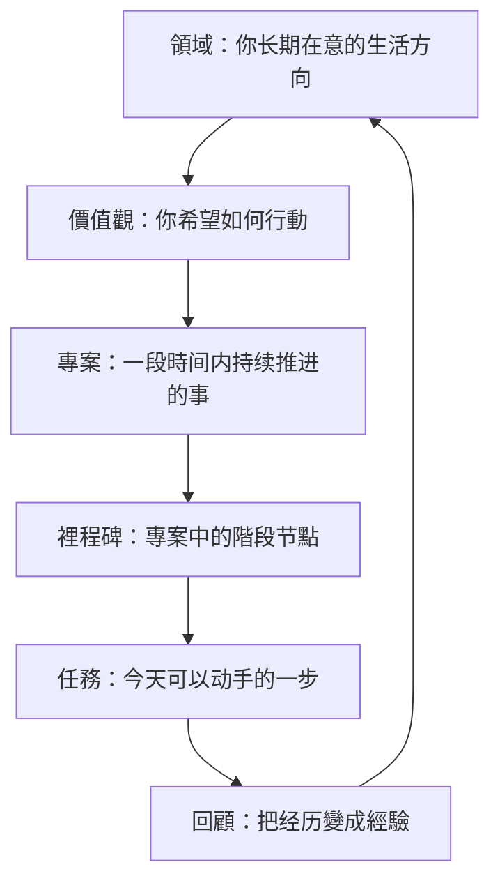

很多人第一次接触 GranoFlow 時，真正困惑的不是“怎么點按钮”，而是：

> 我腦子裡的這件事，到底该放到哪裡？

有些念头像任務，有些更像长期方向；有些事情今天就能做，有些则需要花几周、几个月慢慢推进。
如果這些东西全都挤在同一个清单裡，你很容易同時感到两种压力：

- 事情很多，但不知道先做什么
- 好像一直在忙，但又说不清自己在靠近什么

這就是為什么 GranoFlow 不只是一张任務清单。
它更像一张行動地图：帮你把一个模糊的念头，慢慢放回合适的位置，再把它變成今天能做的一步。

## 先记住這张地图

在 GranoFlow 裡，一条完整的路径通常是這样的：

這不是一张要求你一次填满的表格。
它只是帮你回答六个不同的问题：

- 我长期在意什么？
- 我希望自己怎么行動？
- 我這段時间在推进什么？
- 当前先完成哪一段？
- 今天先做哪一步？
- 這次行動告诉了我什么？

当這些问题分开以後，很多混乱都会明显减轻。

## 為什么不能只有任務

很多工具只帮你记录“要做什么”，但不会帮你看见“為什么做”。
于是任務越记越多，你也可能越来越忙，却越来越难感到自己在向某个方向前进。

ACT 和《幸福的陷阱》裡有一个很重要的實踐思想：
**行動不是只靠效率推动的，行動還需要方向。**

如果没有方向，任務很容易變成机械处理。
如果只有方向，没有任務，方向又会停留在空话裡。

GranoFlow 的结构，就是把這两件事重新连起来：

> 讓长期方向能落地，讓今天的行動也能回得去。

## 領域：我长期在意什么

領域是你长期在意的生活方向，比如：

- 工作學習
- 人际關係
- 身心健康
- 业余創作

領域不是任務分类文件夹，也不是短期目標。
它更像你人生地图上的几块区域，帮助你看见：最近我把時间和注意力，主要投向了哪裡。

容易混淆的例子：

| 不是領域 | 更适合做 |
| --- | --- |
| 完成一个 App 版本 | 專案 |
| 每周跑步三次 | 任務或习惯 |
| 工作學習 | ✅ 領域 |
| 身心健康 | ✅ 領域 |

如果你发现某些事情反复出现、长期占用注意力，它背後通常对應着某个領域。

## 價值觀：我希望自己怎样行動

領域回答的是“哪一块生活值得我投入”。
價值觀回答的是：**在這块生活裡，我希望自己成為怎样的人。**

價值觀不是目標。目標可以完成，價值觀不会被一次性打勾。

例如：

> 三个月减重 5 公斤

這是目標。

> 我希望长期照顾身体，而不是一直透支自己。

這是價值觀。

再例如：

> 发布一个产品版本

這是目標。

> 我希望自己成為一个可靠、清楚、能交付的人。

這是價值觀。

價值觀的作用，不是在顺利時锦上添花。
它真正有用的時刻，往往是你状态不好、犹豫不决、想逃避的時候。
那時它会提醒你：

> 哪一种行動，更接近我想成為的人？

## 專案：我這段時间在推进什么

專案是介于“长期方向”和“今天任務”之间的容器。
它承接的是一段時间内持续推进的事情，通常会持续几天到几个月。

你可以先问自己一个简单问题：

> 這件事今天能直接做完吗？

如果能，写成任務就夠了。
如果它会反复占用注意力，需要多次推进、拆分、跟进，它更适合成為專案。

例如：

- 回复一封邮件 → 任務
- 准备一次考试 → 專案
- 跑步 20 分钟 → 任務
- 建立三个月锻炼节奏 → 專案

專案的作用，是给持续投入一个稳定容器。
没有專案，很多重要的事会一直停留在“我以後要认真做”這种模糊状态裡。

## 裡程碑：当前先完成哪一段

裡程碑是專案裡的階段节點。
它不是為了增加复杂度，而是為了帮你把“大目標”切成几段看得见的路。

例如，一个專案叫：

> 完成产品版本

它可以拆成：

- 完成核心功能
- 修复主要问题
- 准备发布材料
- 提交审核

這样你每天就不需要面对“整个版本”這个庞然大物，
而只需要面对：

> 現在這一段，先推进什么？

如果專案很小，裡程碑可以没有。
但如果你看着一个專案，不知道该从哪繼續，它通常就该拆階段了。

## 任務：今天先做哪一步

任務是 GranoFlow 裡最接近现实行動的一层。
一个好任務，應该讓你看完就知道怎么开始。

例如：

- 写完首页文案
- 检查登录流程
- 整理 10 个测试反馈
- 给朋友发一条确认消息

不太好的任務通常太大、太虚，或者更像愿望：

- 变得更自律
- 做好产品
- 学好英语
- 处理所有问题

如果一个任務讓你迟迟无法开始，通常不是你不夠努力，而是它還不夠具体。
繼續拆小，直到它變成一个能在今天开始的动作。

你可以把任務理解成一句很朴素的话：

> 不问“我该不该做完全部”，只问“我現在先做哪一步”。

## 回顧：這次行動说明了什么

回顧是這张地图裡最容易被忽略、但也最重要的一步。

如果没有回顧，任務完成後只会變成一个被划掉的清单项。
有了回顧，你才会慢慢知道：

- 什么方法对自己有效
- 哪些行動真的推动了專案
- 哪些努力更接近價值觀
- 哪些方向其实已经不再重要

回顧時不需要写很多。
你可以只问几个问题：

- 今天完成了什么？
- 哪些行動更接近我重视的方向？
- 這次卡住的地方是什么？
- 下一步是什么？

這样，回顧就不是额外工作，而是把经历慢慢變成經驗。

## 不需要从最上面开始

很多人看到“領域 → 價值觀 → 專案 → 任務”這条路径，会以為自己應该先搭完整套结构。
其实不必。

最常见、也最自然的起點，反而是任務。

你可以先把腦中的事寫下来。
之後发现它会持续占用注意力，再把它整理成專案。
專案变大了，再拆出裡程碑。
回顧做久了，你再慢慢看见自己长期在意的領域和價值觀。

也就是说，這条路既可以从上往下走，也可以从下往上长出来。

:::tip[结构不是负担，而是减轻负担的工具]
最简单的路径是：先写任務 → 发现它会持续就建專案 → 專案变大了再拆裡程碑 → 回顧時慢慢整理領域和價值觀。你不需要一开始就全都准备好。
:::

## 一个完整例子

假设你腦中冒出一句很模糊的话：

> 我得把手册做好。

如果它只停在這裡，你很容易既焦虑又不知道从哪开始。

把它放进這张地图裡，事情就会慢慢清楚：

- **領域**：工作學習
- **價值觀**：我希望自己成為一个可靠、清楚、能交付的人
- **專案**：完成 GranoFlow 新手手册第一版
- **裡程碑**：完成第二章改写
- **任務**：重写“从領域到任務”這一篇
- **回顧**：今天把章节结构理顺了。下一步去重写“长期方向”。

這就是 GranoFlow 最核心的事情：
**不是把生活变复杂，而是把模糊的压力，慢慢翻译成可以行動的一步。**

## 下一步

如果你已经理解這张地图，下一步最适合繼續读：

- [先确定长期方向](/zh-tw/value-to-action/long-term-direction/)：理解領域和價值觀為什么不是口号。
- [專案與裡程碑：把长期方向拆成階段目標](/zh-tw/value-to-action/projects-and-milestones/)：学会给持续投入建立骨架。
- [任務與收集箱：把下一步寫下来](/zh-tw/value-to-action/tasks-and-inbox/)：把模糊的压力變成可执行動作。
