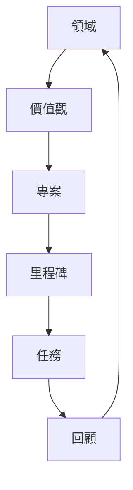

GranoFlow 不只是一個 Todo 清單，更像一本「帶結構的生活手冊」。

## 領域

領域是你長期在意的生活方向，比如「工作學習」「身心健康」「業餘創作」。

## 價值觀

價值觀不是目標——目標可以完成，價值觀不能被一次性打勾。

> 「三個月減重 5 公斤」→ 目標  
> 「我希望長期照顧身體」→ 價值觀

## 專案與里程碑

專案是持續幾天到幾個月的目標容器。里程碑把大專案拆成可見的階段。

## 任務

任務是今天能動手的一步。太難開始的任務，通常是還不夠具體——繼續拆小。

:::tip[不必一開始就搭好全部結構]
先寫任務 → 發現它會持續就建專案 → 專案變大再拆里程碑。
:::
