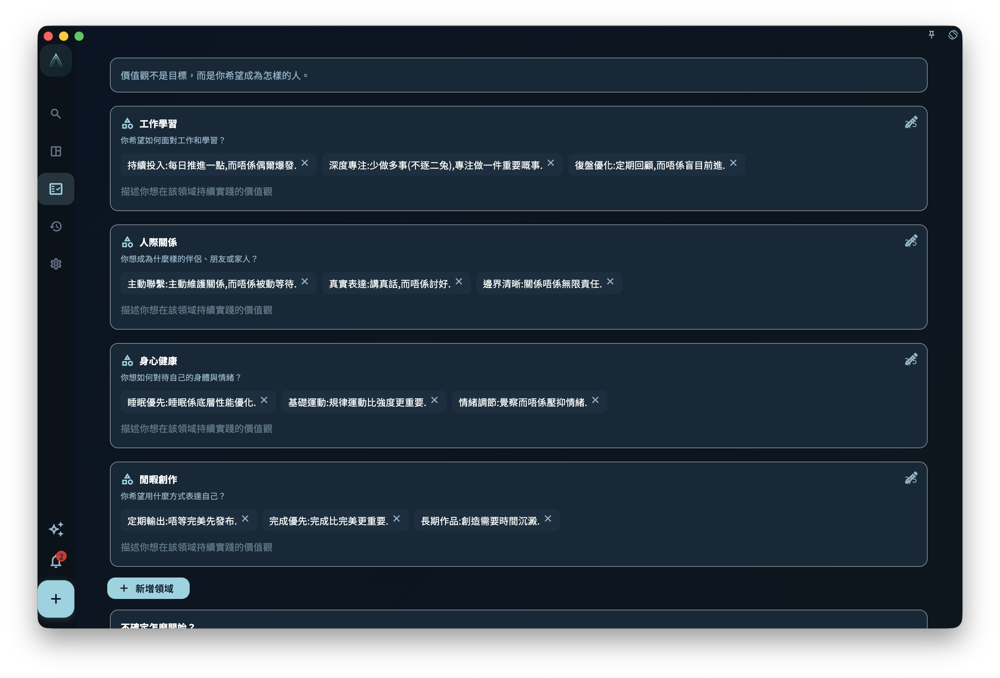

很多人並不是不努力，而是努力了很久以後，开始隐约觉得：

> 我每天都在做事，但我说不清自己到底在靠近什么。

任務越来越多，專案一个接一个，日程也排得很满。可如果這些行動背後没有长期方向，生活就很容易變成一种持续运转的忙碌。

這也是為什么，在 GranoFlow 裡，“領域”和“價值觀”不是装饰性的設定项。它們不是讓你写一份漂亮的人生宣言，而是帮助你在任務和專案之外重新看见：

- 我长期在意什么？
- 我希望自己怎样行動？
- 我最近做的這些事，真的靠近了那个方向吗？

如果你想把长期目標變成今天能做的事，先不用急着整理一整套人生规划。你可以先用領域记录长期方向，再用價值觀说明自己希望如何行動，之後再把它們慢慢連結到專案、裡程碑、任務和回顧。

## 領域不是分类文件夹

領域是你长期在意的生活方向。
它不是普通文件夹，也不是為了把任務分门别类而存在。

常见領域包括：

- 工作學習
- 人际關係
- 身心健康
- 业余創作

如果说任務回答的是“現在做什么”，專案回答的是“這段時间推进什么”，那么領域回答的是：

> 我的人生主要投向哪些方向？

例如，准备考试不是領域，更适合作為專案。
每天跑步不是領域，更适合作為任務或习惯安排。
写一本小说也不是領域，更适合作為專案。

這些事情背後，才更接近領域：

- 准备考试，可能属于工作學習
- 每天跑步，可能属于身心健康
- 写一本小说，可能属于业余創作

領域的作用，是讓你在回顧時能看见：最近的時间和注意力，主要流向了哪裡。
如果你发现自己几个月都在处理工作，却几乎没有照顾身体、關係或創作，那不是系統在责备你，而是它在帮助你看见现实。

## 價值觀不是目標

這大概是整章最重要的一點。

目標可以完成，價值觀不能被一次性完成。

例如：

> 三个月减重 5 公斤

這是目標。

> 我希望长期照顾身体，而不是一直透支自己。

這是價值觀。

再例如：

> 发布一个产品版本

這是目標。

> 我希望自己成為一个可靠、持续交付的人。

這是價值觀。

目標适合放进專案和裡程碑。
價值觀更像一种长期方向：它不会在某一天被打勾完成，但会反复影响你之後的選擇。

這也更接近 ACT（接纳與承诺疗法）裡 values 的用法。
價值觀不是“等我状态好了再考虑的事”，而是在你不确定、困难、混乱、甚至想逃避的時候，仍然能指向行動的方向。更多背景可以读 [ACT 與《幸福的陷阱》](/zh-tw/value-to-action/act-loop/)。

價值觀真正有用的時刻，不是在一切顺利時，而是在你犹豫時，它能帮助你回答：

> 哪一种行動，更接近我想成為的人？

## 為什么人会忙，却失去方向

现实裡最常见的情况不是“什么都不做”，而是“做了很多，却慢慢失去感觉”。

你可能：

- 一直在处理任務，但没有在推进真正重要的事
- 一直在满足外界要求，却越来越不清楚自己在乎什么
- 一直在追求效率，却越来越难感到自己活得像自己

如果没有領域和價值觀，任務系統就很容易變成单纯的执行系統。
你会变得越来越会处理事情，却未必越来越知道自己為什么做這些事。

GranoFlow 引入領域和價值觀，不是為了讓系統更复杂，而是為了讓“行動”重新有出处。

## 如何写一条真正可用的價值觀

很多人第一次写價值觀時，会先写一些抽象词：

> 自律
> 健康
> 成长
> 创造力

這些词本身没有错，但太短、太空，真正要用的時候，往往很难指导行動。

更好的方式，是用一句完整的话，写出你希望如何行動。
可以从這些句式开始：

> 我希望自己……
> 我希望在這个領域裡……
> 当事情变难時，我希望自己仍然……
> 我不希望自己只是……，而是……

例如：

> 我希望自己遇到困难時仍然能繼續推进。
> 我希望长期照顾身体，而不是一直透支自己。
> 我希望在人际關係中更诚实，也更愿意倾听。
> 我希望自己不是只消费内容，也能持续表达和创造。
> 我希望在工作中成為一个可靠、清楚、能交付的人。

一条好的價值觀不一定要漂亮。
它只需要在你犹豫時，能帮你判断：下一步更接近哪个方向。

## 每个領域先写 1–3 条就夠了

不要一开始就写人生宣言。
每个領域先写 1–3 条，就已经足夠开始。

太多價值觀会變成口号墙，反而不会被使用。你真正需要的，不是数量，而是少数几条能反复提醒你的方向。

例如，身心健康下面可以先写：

> 我希望长期照顾身体，而不是一直透支自己。
> 我希望自己在状态不好時，也能做一點温和的恢復。

业余創作下面可以先写：

> 我希望自己不是只消费内容，也能持续表达和创造。
> 我希望先完成小作品，再追求完美。

這已经足夠开始。
價值觀不是写得越多越好，而是越能影响真实行動越好。

## 在領域页裡维护這些方向

領域页用来维护长期方向和價值觀，不是必须一次填完的分类系統。你可以从首页引导、侧栏管理入口或相关設定进入領域管理，然後逐个領域添加、修改或删除几条價值觀。

<!-- manual-screenshot:id=value-domains-management -->

如果截图没有加载，也不影响理解。你可以把這个页面想成一个“方向整理页”：每个領域下面都有自己的價值觀列表；页面会用一些提示问题，帮助你把抽象念头写成一句完整的话，而不是只留下一个漂亮但难用的词。

如果页面提供 AI 辅助入口，它做的只是把当前内容整理成适合给外部 AI 的请求。AI 可以帮助你探索表达，但不会替你决定人生方向。最终保存哪些内容，仍以你在領域页中的判断為准。

## 價值觀要落到行動上

價值觀如果不能落到行動，就会慢慢失效。
它会變成一句挂在页面上的好话，但不会真的影响生活。

例如，你寫下：

> 我希望长期照顾身体，而不是一直透支自己。

它可以連結到專案：

> 建立三个月的基础锻炼节奏

專案可以拆成裡程碑：

> 第一周适應
> 第一个月稳定
> 三个月形成基本节奏

今天的任務可以是：

> 做 20 分钟低强度训练

這样，價值觀就不是一条抽象句子，而是进入了今天能做的一步。

再例如，你寫下：

> 我希望自己成為一个可靠、持续交付的人。

它可以連結到專案：

> 完成当前产品版本

今天的任務可能是：

> 修复登录页的一个阻塞问题

這就是 GranoFlow 想帮助你连起来的一条线：

> 價值觀 → 專案 → 裡程碑 → 任務 → 回顧

## 價值觀不是定稿，而是会慢慢被修正

很多人以為，價值觀應该是一组一开始就写得很准、很成熟的话。
其实不是。

刚开始寫下的價值觀，可能很粗糙，也可能後来发现並不准确。這很正常。
價值觀不是考试答案，而是你在真实生活中慢慢辨认出来的方向。

你可以在日回顧或階段回顧中观察：

- 最近我做的事，是否真的接近這些價值觀？
- 哪些價值觀只是听上去正确，但我其实並不真正重视？
- 哪些行動反复出现，说明我真正看重的是别的东西？
- 現在的專案，是否還值得繼續投入？

有時候，回顧会讓你发现某条價值觀需要改写。

例如：

> 我希望每天都保持高效率。

這句话听上去积极，但可能太压迫。你也许会把它改成：

> 我希望在状态不完美時，也能稳定推进最重要的一步。

這更接近 GranoFlow 的使用方式：不是追求永远高效，而是在真实生活裡保持方向感。

## 如果暂時写不出来，也没關係

如果你現在還写不出價值觀，不要因為這个卡住。

你可以先繼續使用任務、專案和回顧。等你积累了一些真实记录，再回头看：

- 哪些事情讓我觉得值得？
- 哪些事情完成後，我会觉得更像自己？
- 哪些事情虽然困难，但我仍然不想放弃？
- 哪些事情看似忙碌，其实只是消耗？

價值觀常常不是“想出来”的，而是在反复行動和回顧中“看出来”的。

所以，刚开始時可以很简单：

> 我希望自己能稳定推进重要的事。
> 我希望自己能照顾身体。
> 我希望自己能认真对待重要關係。
> 我希望自己能持续創作。

先寫下来，之後再改。
這已经比什么都不写、什么都不看，要更接近真正的方向。

## 下一步

当你有了初步的領域和價值觀，就可以繼續把长期方向拆成更具体的承接结构：

- [專案與裡程碑：把长期方向拆成階段目標](/zh-tw/value-to-action/projects-and-milestones/)：把持续投入放进一个能推进的容器。
- [任務與收集箱：把下一步寫下来](/zh-tw/value-to-action/tasks-and-inbox/)：把階段落到今天能做的一步。
- [回顧：讓经历真正沉淀](/zh-tw/value-to-action/review-reflection/)：在真实行動後，慢慢修正和确认你的方向。
