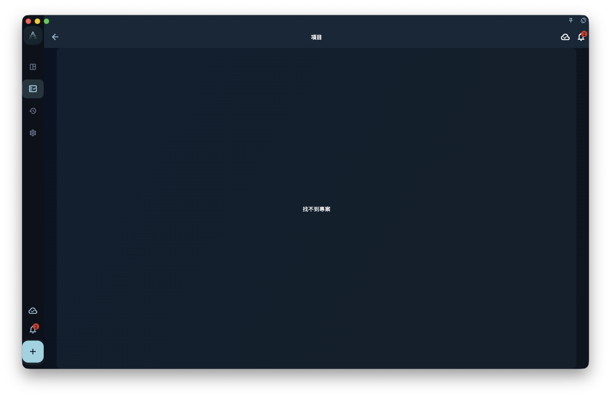

如果你已經知道自己重視什麼，但不知道今天該做什麼，可以先建立一個專案，再把它拆成里程碑和任務。專案用來承接一段時間內持續推進的目標，里程碑用來標出目前階段，任務用來寫下今天能做的下一步。

有了領域和價值觀之後，不要急著寫一大堆任務。

先問自己：

> 這段時間，我想持續推進什麼？

這個答案，通常就是專案。

## 專案是什麼

專案是一段時間內持續推進的目標。

它比任務更大，比人生願望更具體。

例如：

- 完成目前產品版本
- 準備一次考試
- 建立三個月運動節奏
- 完成第一組漫畫
- 建立個人網站
- 整理一次搬家計畫

這些都適合作為專案。

專案不適合寫成一句很大的願望。

例如：

- 變得更自律
- 學好英文
- 改善生活
- 做好產品
- 成為更好的人

這些說法太大、太模糊。它們更像價值觀、長期方向，或者還需要繼續拆分的問題。

一個好的專案，應該能回答這個問題：

> 做到什麼程度，才算這一階段結束？

<!-- manual-screenshot:id=projects-milestones-detail -->

## 什麼時候需要建立專案

不是所有事情都需要專案。

如果一件事今天就能完成，直接寫成任務就夠了。

例如：

- 回覆一封電子郵件
- 買一件東西
- 改一個按鈕文案
- 預約一次健康檢查

這些不需要專案。

如果一件事有下面這些特點，就適合建立專案：

- 需要持續幾天或幾週
- 需要多個步驟
- 中途可能暫停，之後再回來繼續
- 需要整理資料、任務和階段
- 完成後值得回顧經驗

例如，「寫一篇文章」可能只是任務。
但「連續寫完一個系列文章」就適合成為專案。

「跑步 20 分鐘」是任務。
「建立三個月跑步節奏」是專案。

「修一個小 Bug」是任務。
「完成一個版本發布」是專案。

專案的作用，是給一段持續投入一個容器。

## 里程碑是什麼

里程碑是專案裡的階段節點。

它回答的是：

> 目前先完成哪一段？

例如，一個專案叫：

> 完成目前產品版本

它可以拆成這些里程碑：

- 完成核心功能
- 修復主要問題
- 準備發布材料
- 提交審核
- 處理審核回饋

一個專案叫：

> 建立三個月運動節奏

它可以拆成：

- 第一週適應
- 第一個月穩定
- 第二個月提高強度
- 第三個月形成固定節奏

里程碑不是為了讓專案變複雜。

它的作用是把一個大目標切成幾段。這樣你每天不用面對整個專案，只需要知道現在正在推進哪一段。

## 小專案可以沒有里程碑

不要為了完整而強行新增里程碑。

如果一個專案很小，只有三五個任務，直接用專案管理就夠了。

例如：

> 整理一次旅行資料

它可能只有幾個任務：

- 確認機票
- 整理護照資料
- 儲存飯店訂單
- 檢查行李清單

這種專案不一定需要里程碑。

但如果專案很長、任務很多，或者會持續超過幾週，最好加里程碑。否則專案很容易變成一堆越來越重的任務。

判斷標準很簡單：

> 如果你看著專案，不知道下一步該從哪裡繼續，就該拆里程碑。

## 專案不要太大

太大的專案會讓人很難開始。

例如：

> 改變人生

這不是專案。

> 學好英文

也太大。

可以拆成更具體的專案：

- 完成一本英文教材
- 堅持 30 天口說練習
- 準備一次英文面試
- 看完一門英文課程

再比如：

> 做好 GranoFlow

也太大。

可以拆成：

- 完成新手手冊第一版
- 修復圖片上傳體驗
- 準備公測使用者邀請
- 完成 App Store 審核材料

專案越具體，越容易推進。

如果一個專案永遠無法完成，它通常不是一個好專案。它可能應該被拆成多個專案，或者上升為領域和價值觀。

## 專案要能落到任務

專案不能只停留在標題上。

每個專案最後都要落到今天可以做的一步。

例如：

專案：

> 完成新手手冊第一版

里程碑：

> 寫完前 6 章

今天的任務：

> 寫完「專案與里程碑」這一章草稿

這樣你每天面對的就不是一個模糊的大目標，而是一個清楚的下一步。

如果一個專案下面沒有任何任務，通常有兩種可能：

第一，它還只是願望，沒有進入執行階段。
第二，它太模糊，需要先拆成里程碑或任務。

GranoFlow 的專案不是用來收藏願望的。專案應該幫助你行動。

## 專案可以完成

專案完成，表示這一階段的目標已經結束。

完成不代表它完美，也不代表以後不會繼續做相關事情。

例如：

> 完成第一組漫畫

這個專案完成後，你以後仍然可以建立新專案：

> 完成第二組漫畫

這樣比把所有創作都塞進一個永遠不會結束的「漫畫專案」更清楚。

專案完成後，可以在回顧中看：

- 哪些任務真正推進了專案？
- 哪些階段比預期困難？
- 哪些經驗可以保留到下一個專案？
- 這個專案是否接近我的價值觀？

完成專案，不只是關閉一個容器，也是把一段時間的投入變成經驗。

## 專案可以歸檔或放棄

不是所有專案都必須完成。

有些專案會過期。
有些專案會失去意義。
有些專案開始後，你才發現它並不重要。
有些專案只是當時需要，現在已經不需要了。

這時可以歸檔，或者放棄。

放棄不是失敗。

真正的問題不是「我有沒有完成所有專案」，而是：

> 我有沒有看清它為什麼不再值得繼續？

例如：

> 我原本想做這個課程，但現在發現它和目前方向關係不大。先歸檔，之後不再佔用注意力。

這就是有效的回顧。

GranoFlow 不要求你把每一個開始過的專案都做到最後。它更重視的是：你是否能從行動中看見自己的方向，並及時調整。

## 一個完整例子

領域：

> 工作學習

價值觀：

> 我希望自己成為一個可靠、清楚、能交付的人。

專案：

> 完成 GranoFlow 新手手冊第一版

里程碑：

> 完成前 3 章
> 完成核心功能說明
> 完成資料安全說明
> 完成發布前校對

任務：

> 寫完「快速開始」
> 修改「把價值變成行動」
> 補充「核心概念」
> 校對術語一致性

回顧：

> 今天完成了專案與里程碑章節。結構比之前清楚，但任務和收集箱還需要單獨寫一章。下一步寫任務系統。

這樣，一條價值觀就落到了專案、里程碑、任務和回顧裡。

你不是只是在完成待辦事項，而是在用一段時間的行動，靠近自己重視的方向。

## 下一步

有了專案和里程碑之後，就可以開始處理每天的具體行動。

下一章可以繼續閱讀：

> 任務與收集箱：把下一步寫下來。
